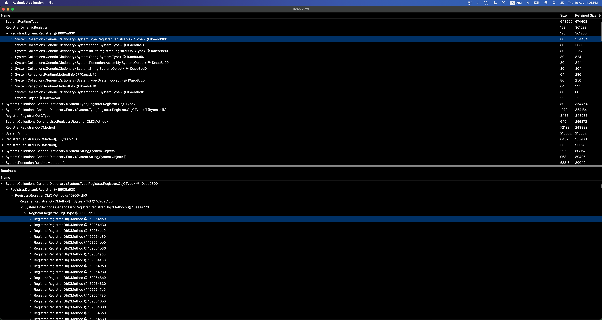

# Simple viewer for .NET .gcdump files



## Installation

`dotnet tool install -g dotnet-heapview`

For the MCP server:

`dotnet tool install -g dotnet-heapview-mcp`

## Usage

`dotnet-heapview <path to .gcdump file>`

## MCP server

`dotnet-heapview-mcp` starts a stdio Model Context Protocol server for heap analysis.

After installation, configure your MCP client to run:

`dotnet-heapview-mcp`

During development, run it with:

`dotnet run --project src/OneHub.Tools.HeapView.Mcp`

Example MCP client configuration:

```json
{
  "mcpServers": {
    "heapview": {
      "command": "dotnet-heapview-mcp"
    }
  }
}
```

The server exposes heap tools backed by dotnet-heapview's graph model: `load_heap`, `get_summary`, class queries, instance queries, outgoing references, incoming references, paths to roots, GC roots, preserved counters, and top-object analysis. It supports `.gcdump`, `.hprof`, and `.mono-heap` through the existing dotnet-heapview converters.
