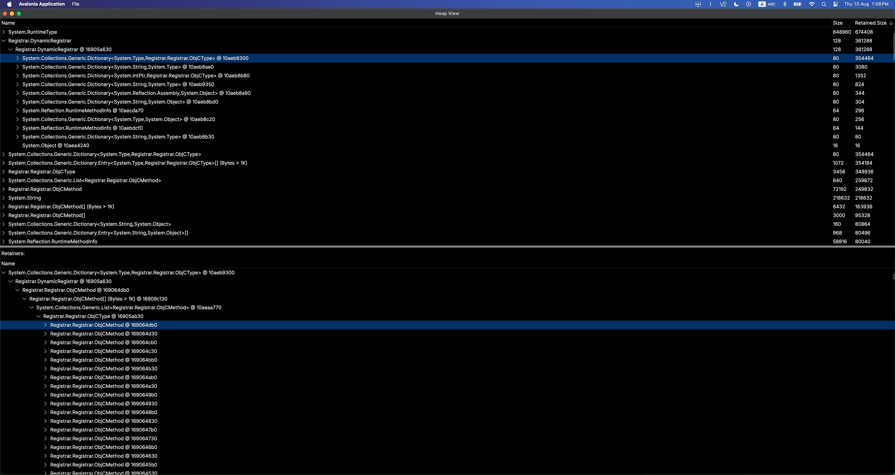

# dotnet-heapview

dotnet-heapview is a desktop viewer for managed heap dump files.



## Installation

```powershell
dotnet tool install -g dotnet-heapview
```

## Usage

Open a dump from the command line:

```powershell
dotnet-heapview <path-to-dump>
```

You can also start the tool without an argument and choose a dump file from the file picker.

### macOS NativeAOT symbols

NativeAOT GC dumps may contain type-table addresses instead of names. Supply the
matching dSYM bundle (or unstripped linked executable) when opening the dump:

```sh
dotnet-heapview dump.gcdump --symbols /path/to/MyApp.app.dSYM
```

Without `--symbols`, the viewer checks the module path recorded in the dump,
looking for an adjacent `.dSYM` or `.app.dSYM`, then symbols in the executable.
The option also applies to files subsequently opened in that viewer session.
The symbol file must come from the exact build that produced the dump. When the
recorded executable still exists, the viewer checks its UUID against the symbols;
the dump itself does not retain a macOS UUID, so that executable must also be the
original build.

Currently supported: thin, little-endian 64-bit Mach-O files and dSYMs retaining
their native symbol table. Explicit symbol selection supports a single native
module. Universal binaries, Windows PDBs, Linux ELF symbols, and symbol uploads in
the browser viewer are not supported by this resolver.

Names retain NativeAOT's compiler spelling, such as `S_P_CoreLib_System_RuntimeType`
and `__Array<UInt8>`. Synthetic GC-static storage uses `__GCStaticEEType_...`
layout names; these do not identify the declaring managed class. Unmatched
addresses remain `TypeID(...)`.

## Supported Dump Formats

- `.gcdump`
- `.hprof`
- `.mono-heap`

## Development

Run from source with:

```powershell
dotnet run --project src/OneHub.Tools.HeapView -- <path-to-dump>
```
